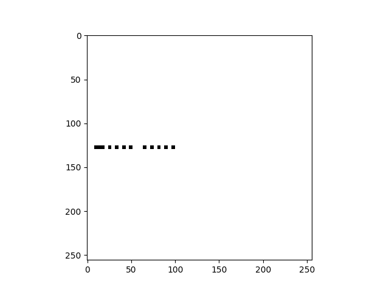

# Boxy

## Introduction
The challenge is presented with the following text:
>You're given a spec resembling Chinese for a proprietary image protocol. Study the attached example images to discover the flag in the captured transmission.

After downloading and extracting the provided file, we get:
- A txt file called `boxy.txt` apparently written in Chinese (although Google translate does not seem to be able to make any sense of it)
- A binary file called `reverseme`, which is the captured transmission that we will have to decode
- A folder called `examples`, containing several binary files (`0x00.bin`, `0x01.bin`, etc.) which presumably have been used to create the png files that we also find. We note that in certain cases it seems that more than one image is associated with the same binary (for instance, we have `0x01.bin.png`, `0x01.bin_1.png`, `0x01.bin_2.png`, etc.). You can find all these files in the [files](files) folder.

## Squares of many colours
We start by looking at the first two examples. First, we use the `file` command to be sure we are not missing anything. Here's the output for the files `0x00.bin` and `0x00.bin.png`:
```bash
$ file 0x00.bin
0x00.bin: data
$ file 0x00.bin.png
0x00.bin.png: PNG image data, 256 x 256, 8-bit gray+alpha, non-interlaced
```
Not much to learn here besides that the PNG image is 256x256. So let's keep on digging, this time dumping the data in the binary file using the `xxd` command:
```bash
$ xxd 0x00.bin
00000000: 01ff 02ff 0300 ff00                      ........
```
We see that the content is pretty short. The corresponding image is just a white 256x256 square:

<kbd></kbd>

So let's look at the dump of the second example, `0x01.bin`:
```bash
$ xxd 0x01.bin
00000000: 01ff 02ff 0300 ff00 0301 ff00 0302 ff00  ................
00000010: 0303 ff00 0304 ff00 0305 ff00 0306 ff00  ................
00000020: 0307 ff00                                ....
```
The first thing we note is that it starts exactly as the previous example. Moreover, the corresponding images are 8 squares of different colors, the first one being white:

<kbd></kbd>
<kbd></kbd>
<kbd></kbd>
<kbd></kbd>
<kbd></kbd>
<kbd></kbd>
<kbd></kbd>
<kbd>

So it seems that the snippet:
```
01ff 02ff 0300 ff00
```
should mean something like "plot a white square". Looking at the rest of the hex dump, we only see *instructions* of the form:
```
030x ff00
```
where `x` takes the values 1, ..., 7. It's pretty reasonable to think, then, that these instructions correspond just to the colour of the square.

## Intermission - let's look at the txt file
At this point, let's take a quick look at the file `boxy.txt`. Scrolling down a little bit we find the following text:
```
0x01 0xff
0x02 0xff
0x03 0x00
0xff 0x00 ; 巫乸 墰扉 奓夗 嶛儗 0
0x03 0x01
0xff 0x00 ; 媑寤 串勸 嬂囎 嫒厏 1
0x03 0x02
0xff 0x00 ; 亙慞 乹扚 慨岊 徿彃 2
0x03 0x03
0xff 0x00 ; 劳啈 仜姈 抻人 婚处 3
0x03 0x04
0xff 0x00 ; 扒廊 傋打 徬壸 崍应 4
0x03 0x05
0xff 0x00 ; 届嬎 怺壙 徾屻 佡垫 5
0x03 0x06
0xff 0x00 ; 尗彟 嫣拮 嫡峒 偢嫚 6
0x03 0x07
0xff 0x00 ; 奥嫄 剁峓 垔佴 嘔偬 7
```
It's clearly the same data that we saw in the previous hex dump plus some annotations in "Chinese" (well, whatever). What's important here to note is:
- It seems that each instruction is composed by two bytes, but these need to be read separately.
- The instruction `0xff 0x00` is repeated many times, more precisely every time that an annotation is done. These seem to refer to the 8 images with squares of different colours.

So let's make our first assumptions:
- `0x03` means **paint** the square defined in the previous instructions of the color given by the next byte, being `0x00 = white`, `0x01 = black`, `0x02 = red` and so on.
- `0xff 0x00` means **plot** the square defined in the previous instructions.
Still, we don't really know what the instructions:
```
0x01 0xff
0x02 0xff
```
mean exactly, since "define a square" seems too vague. So let's look at the next picture!

## Shrinking & moving the squares around
Ok, so taking a look at the hex dump of `0x02.bin` we see the following:
```bash
$ xxd 0x02.bin
00000000: 0180 0280 0300 ff00 0480 0580 ff00 0301  ................
00000010: 0400 0580 ff00 0480 0500 ff00            ............
```
We distinguish the "paint white" and "paint black" instructions (`0x03 0x00` and `0x03 0x01` respectively), but the beginning is different and we see some instructions that we have not seen before, starting with `0x04` and `0x05`. The last two associated images (`0x02.bin_2.png` and `0x02.bin_3.png`) are:

<kbd></kbd> <kbd></kbd>

(we are not showing the first ones since they only have white squares). We see white and black squares indeed, but they are smaller than before. At this point, we recall that the image is 256x256 pixels and 0xff is 255 in decimal. The squares in the last images are half in height and width, that is 128x128. And 128 in hexadecimal is 0x80!

So it seems clear that `0x01` defines the height or width of a rectangle (defined in the next byte) while `0x02` defines the other dimension. Since we only have plotted squares until now, at this moment we cannot be sure which instruction corresponds to which dimension, but following common sense, we're going to do the following guess (which we'll see is correct later on):

- `0x01 N` means **set the width** of the rectangle to N
- `0x02 N` means **set the height** of the rectangle to N

Now, what do the instructions `0x04` and `0x05` mean? Note that, if our assumptions are correct, in the last dump we only have one instruction that creates a square, namely:
```
0x01 0x80
0x02 0x80
```
so we can guess that the other instructions must correspond to translations. Looking at the dump we see that the first of such instructions are:
```
0x04 0x80
0x05 0x80
0xff 0x00
```
At this point, it seems pretty clear that the byte following `0x04` / `0x05` should mean the coordinates where the square is moved to (actually, the upper left corner). In this case, the white square initially created is moved to x = 128 and y = 128 (here, the coordinates of the upper left corner of the image are x = 0 and y = 0, while the coordinates of the lower right corner of the image are x = 256 and y = 256). Comparing the next instructions with the image `0x02.bin_2.png` we can decode the exact meaning of each instruction:
```
0x03 0x01       # paint the square in black
0x04 0x00       # move the square to x = 0
0x05 0x80       # move the square to y = 128
0xff 0x00       # plot the square
```

## Rectangles & more translations
So we're getting to the end... the hex dump of `0x03.bin` is the following:
```bash
$ xxd 0x03.bin
00000000: 01ff 02ff 0300 ff00 0108 0210 0458 0558  .............X.X
00000010: 0302 0740 ff00 0303 0940 ff00 0304 0640  ...@.....@.....@
00000020: ff00 0305 0840 ff00                      .....@..
```
We are going to analyze each set of instructions in more detail. The first set is easy to understand by now:
```
0x01 0xff
0x02 0xff
0x03 0x00
0xff 0x00       # plot a 256x256 white square
```
The next set of instructions are:
```
0x01 0x08
0x02 0x10       # create a 8x16 rectangle
0x04 0x58
0x05 0x58       # move the rectangle to x = 88 and y = 88
0x03 0x02       # paint the rectangle in red
0x07 0x40       # *** Unknown instruction ***
0xff 0x00       # plot it
```
We need to figure out what the unknown instruction does. The corresponding picture `0x03.bin_1.png` is:

<kbd></kbd>

Inspecting it with any image editor we can see that the upper left corner of the rectangle has coordinates x = 88 and y = 152. The previous instruction had left the rectangle at x = 88 and y = 88, and taking into account that 0x40 is 64 and that 88 + 64 = 152, it is clear that:
- `0x07 N` means **move down** the rectangle by N pixels

Reasoning in a similar way for the remaining sets of instructions and pictures:

<kbd></kbd> <kbd></kbd> <kbd></kbd>

we can easily see that:

- `0x09 N` means **move right** the rectangle by N pixels
- `0x06 N` means **move up** the rectangle by N pixels
- `0x08 N` means **move left** the rectangle by N pixels

## Putting it all together
Now it seems we have everything we need to plot the image defined by the file `reverseme`. To avoid doing it manually, I wrote a simple Python class that allows decoding any such file. To plot it, I simply have kept a 256x256x3 array: the 256x256 part corresponds to each pixel, while the 3 last coordinates correspond to the RGB value of the colour of each pixel. To make the plot, I used the `imshow` function of `matplotlib.pyplot` module. You can find all the code in the file [unboxy.py](unboxy.py).

However, if we execute all the instructions in the file at once, we will find that the result is... a white square!! Great, huh? So, what happened here?

Taking a quick look at the dump of this file we see that it finishes with this set of instructions:

```
01ff 02ff 0300 0400 0500 ff00
```

which, by now, we know that it means: *create a 256x256 square, paint it in white, move it to x = 0 and y = 0, and plot it*. Actually, these instructions are repeated many times along all the file, so it seems that the file will periodically erase what has been plotted before. For this reason, in the file [unboxy.py](unboxy.py) I just added a check that will show the current state of the plot whenever the size of the rectangle is 256x256 (since this means that in the next plot instruction, everything will be overwritten by this rectangle).

## Finally, the flag!
Once we run the Python script we obtain a total of 31 different images. Here I'm showing the first ones, you can find the rest in the [images](images) directory:

<kbd></kbd>
<kbd></kbd>
<kbd></kbd>
<kbd></kbd>

So it seems clear that each one corresponds to a letter in Morse. But looking at a Morse code table, we realize that these are not letters but numbers. To finish, we only need to translate the numbers into their ASCII value, and we obtain the flag:

```
AOTW{ok_hi_so_my_name_is_boxy}
```

Nice to meet you, boxy!
