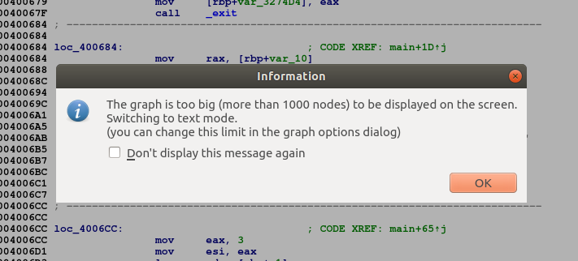

## Xmastree

## Introduction

The challenge is presented with the following text:
>Santa's nerdy cousin has decorated a christmas tree...  
(please note that the recovered string is not in flag format, it must be enclosed in AOTW{...})

Not really informative... Well, we are also given a file called `xmastree`, which is 11,7MB (**!**). The output of the `file` command is:
```bash
$ file xmastree
xmastree: ELF 64-bit LSB executable, x86-64, version 1 (SYSV), dynamically linked, interpreter /lib64/ld-linux-x86-64.so.2, for GNU/Linux 3.2.0, stripped
```
so we see this is a 64-bit ELF file. If we execute it, we get:
```bash
$ ./xmastree
No arg
```
so we can try to pass an argument:
```bash
./xmastree aaaa
This branch has a red ball
```
Ok, that's enough for the time being. Let's use IDA to get an idea of what this executable really does!

## Wait... what?!

The first thing that stands out is that IDA needs *a lot* of time to analyze the executable. Once it finishes, we see many functions listed:

<kbd></kbd>

Moreover, if we go to the `main` function while in Graph View we get this warning:

<kbd></kbd>

So it seems we might be dealing with a quite complicated disassembly. But let's start at the beginning and try to skim a little bit through it.

The first steps in the `main` function are quite clear. I'll try to explain briefly the main points of the first 3 initial blocks of disassembly.

- First of all, the program's arguments, passed through in `edi` and `rsi`, are stored at locations `rbp+var_8` and `rbp+var_10` (recall that the calling convention in x64 ELF files uses these two registers to pass the first two arguments to functions). These arguments are presumably `argc` and `argv`, which is confirmed by the fact that `rbp+var_8` is compared to 2 and, if it's less than 2, the string `No arg\n` is printed and the program exits. This is the behaviour that we have seen before. Otherwise, we jump to `loc_400684` (see next item). The corresponding disassembly is:

  <kbd></kbd>

- Next, the parameter passed to the binary (stored at `argv+8`, that in the disassembly below corresponds to `rax+8`) is stored at a place labelled by IDA as `ds:s` (that is, somewhere in the data segment). Then, it is passed through `rdi` to the `_strlen` function. Then, if the string length is greater than 10 (`0Ah` in hexadecimal notation), the string `Input is too long\n` is printed and the program exits. Otherwise, we jump to `loc_4006CC` (see next item). The disassembly is:

  <kbd></kbd>

- Recall that the argument passed to the program has been stored at `ds:s`. Here, this argument is written back in `rcx` and then it's used to store in `rdi` a string composed by its characters at positions 7, 1 and 4 (in this order). The argument stored in `rsi` is simply 3, which we suppose that is the length of the string in `rdi`. Then, the function `sub_B53220` is called. Again, since we are dealing with an x64 ELF file, `rdi` and `rsi` are the arguments passed to these function. The result of this call is stored in `eax` and then compared to the string `87ef01ed50860be503eee2e15f171df2` using the function `_strcmp`. Note that this string resembles a hash (we'll get back to this fact later on). Finally, if the result given by the function `sub_B53220` equals the given string, the program jumps to some location. The corresponding disassembly is:

  <kbd></kbd>

If we scroll down a little bit, we see many *very* similar blocks of instructions as this last disassembly: first, 3 characters of the program argument are stored in `rdi` (not always the same), then a function is called (sometimes `sub_B53220`, but we find two others: `sub_B532A0` and `sub_B533A0`), and then the result of this call is compared to a string that resembles a hash (not always of the same length). In the case that the two strings are equal, a jump to another location is made.

We can scroll down as much as we want and we'll get tired before reaching the end of the disassembly. Seeing this, it's clear that we shouldn't try to understand *everything* that the binary does. Instead, it seems that we should only analyze the minimum in order to get the flag.

## Avoiding the rabbit holes

We have mentioned that functions `sub_B53220`, `sub_B532A0` and `sub_B533A0` are called many times, but we still don't know what they actually do. We can try to look at their disassembly but soon we'll realize that we are falling through a deep rabbit hole, so we'd better try to find another way to figure out what they do.

As we have mentioned above, the strings that are compared to the result returned by these functions resemble hashes. Thus, we can switch to dynamic analysis with `gdb` and `peda` (see https://github.com/longld/peda), execute the program passing some argument (say `aaaaaaaaaa`) and check if the result returned by these functions is any hash.

We start by setting a breakpoint at address `0x400710` (this address corresponds to the instruction `lea rdi, [rbp+s1]` after the `call sub_B53220` in the last disassembly above):

```bash
gdb-peda$ break *0x400710
Breakpoint 1 at 0x400710
gdb-peda$ run aaaaaaaaaa
```

When the execution stops at the breakpoint, we see the following:

<kbd></kbd>

We are interested in the value of `rax`, which is the return value of the call `sub_B53220('aaa', 3)`. As we can see in the screenshot above, it's a pointer to the string `47bce5c74f589f4867dbd57e9ca9f808`. We can quickly check that it has 32 characters:

```bash
$ echo -n 47bce5c74f589f4867dbd57e9ca9f808 | wc -c
32
```

A typical 32 byte long hash is md5, so let's see if we're lucky:

```bash
echo -n aaa | md5sum
47bce5c74f589f4867dbd57e9ca9f808  -
```

Bingo! That means that the function `sub_B53220` actually computes the md5 hash of the string we pass. To determine what hash functions are `sub_B532A0` and `sub_B533A0` we just need to reason in a similar way and take into account the lengths of the resulting strings. Then, we can easily see that `sub_B532A0` computes the sha1 hash, and `sub_B533A0` computes the sha256.

Great, so now we have a general idea of what the program does after the initial checks:

1. It constructs a string with three characters of the argument
2. It computes its md5/sha1/sha256 hash
3. It compares the result to a fixed value stored in memory and jumps to another place if they are equal.
4. Return to 1 and eventually finish.

Ok... but, when does it finish? And most importantly, how do we get the flag, actually?

## Looking for strings

To find the flag or any hint that might lead us to it, the first thing that comes to our mind is to look for the strings in the binary. Switching to the strings view in IDA (pressing `Shift+F12`), one particular string catches our attention:

<kbd></kbd>

That seems like a good lead! Checking out its cross-references, we see that it's only used once at address `0x09d0c13`:

<kbd></kbd>

From here we can just trace the way back to the start of the main function, following the jumps after each call to the function `_strcmp`. Thus, we will know how to construct the argument such that all of these jumps are taken (that is, that the result of each call to the corresponding hash function results in the hash that we see in the disassembly). The following table lists the hash function used, the corresponding positions of the letters in the original string and the desired result of the hash, starting from the beginning of the main function and following all jumps to the desired point at address `0x09d0c13`.

```
hash function     positions     hash value
-------------     ---------     ----------------------------------------------------------------
md5               7, 1, 4       cb2877f6063e950be80bdd9cf63cccad
sha1              7, 5, 6       8ae43fbad3aa2e57f0ab4206a3710d8dee05b8ca
sha1              2, 1, 2       c7cab1a05e1e0c1d51a6a219d96577a16b7abf9d
sha1              9, 8, 6       f135388c435baf1644480f9dd1d9b53e2c9d23a0
sha1              1, 9, 4       32815afa46f395cb82cf25512d4ca51964afb2e2
sha1              3, 5, 5       8ba7b7562df3de9fa0641b2783e71d738eb44fe2
sha1              0, 3, 6       17d656cc432054e57167d58a148d6aec9c80261c
sha256            2, 3, 9       afaedac802835591860b7e61e1486a8f7ce34cfb8bbf447e01783046da1b0a60
sha1              4, 0, 8       64791691a6ec96929c9c99d98c9ea5623d3936ba
sha1              8, 7, 0       b803ea6cf07a51add8f1eca30e8df5c66eb7f70a
```

## Cracking the hashes & getting the flag

Well, we're almost finished. Taking into account that each hash corresponds to a string of length 3, it's computationally feasible to bruteforce them. For instance, let's take the first row. We can compute the md5 for every combination of 3 characters, until we get the hash value in the last column. Then we know that the 3 characters that produced this hash correspond to the letters of the flag at positions 7, 1 and 4 respectively.

Taking into account that all printable ascii characters have decimal value between 32 and 127, this can be done with the following Python function:

```python
import hashlib

def break_hash(hash):
    for i in range(32,127):
        for j in range(32,127):
            for k in range(32,127):
                s = "{}{}{}".format(chr(i), chr(j), chr(k))
                if hashlib.md5(s).hexdigest() == hash:
                    return s
    # We should never get here
    return None
```

You can find a more general function (working for the 3 types of hashes) in the Python script [hash_cracker.py](hash_cracker.py), as well as all the code to find the flag.

As you probably noticed, we don't really need to bruteforce all hashes in the table, since positions are repeated in different rows. With only 4 hashes we can find all the letters of the flags, and it'll be faster.

If we execute the `hash_cracker.py` script we'll get the flag in a few seconds:

```bash
$ python hash_cracker.py
Flag: H4$Hy_XMA5
```
