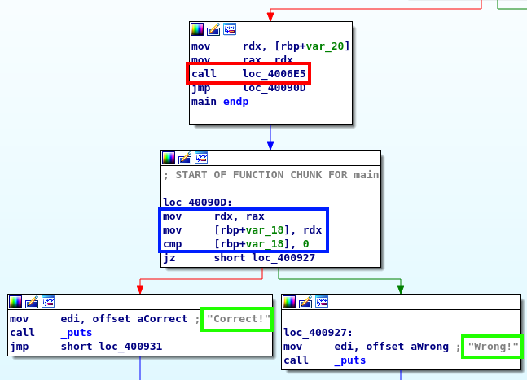
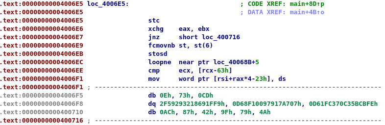

# reee

## Initial Exploration

We download the binary, that turns out to be an x64 ELF:
```bash
$ file reee
reee: ELF 64-bit LSB executable, x86-64, version 1 (SYSV), dynamically linked, interpreter /lib64/ld-linux-x86-64.so.2, for GNU/Linux 2.6.32, BuildID[sha1]=3ccec76609cd013bea7ee34dffc8441bfa1d7181, stripped
```

If we execute it without any parameters, we get the following message (and a segmentation fault):
```
$ ./reee
need a flag!
Segmentation fault
```
If we execute it with a parameter, we obtain the following result:
```
$ ./reee AAAAAAA
Wrong!
```
With that we can already infer that the binary expects the flag to be passed as a parameter, which will be checked to see if it is right or not. Great! So let's start by doing some static analysis and see if we can determine how this check is done.

## Static Analysis

We start analyzing the binary with IDA. Taking a look at the `main` function, the following part catches our attention:



First, the function labeled as `loc_4006E5` is called (red square). After that, the code checks whether the result (stored initially in the `rax` register) is zero or not (blue squares). If it is, the message "Wrong!" is printed using `_puts`, otherwise the message "Correct!" is printed (green squares). This seems to clearly indicate that whatever is done inside the function `loc_4006E5` determines if the parameter passed is the correct flag or not.

Once we identify that, the next logical step is to look at the disassembly of this function. However, we get an unpleasant surprise when we do so, since it does not make any sense at all:



It looks like some kind of obfuscation or encryption is done to this part of the code to hinder precisely static analysis. In the function main there is a whole part that we haven't looked at, and which probably handles the deobfuscation of this function on runtime. So let's run the binary and see how the function looks like when it has already been deobfuscated!

## Starting Dynamic Analysis

We open the binary with `gdb` and use the command `start` (so that it will pause execution at `main`), passing a parameter to see how it is handled.
```bash
$ gdb -q ./reee
Reading symbols from ./reee...
(No debugging symbols found in ./reee)
gdb-peda$ start AAAAAAA
```
The first thing we do after that is set a breakpoint at `0x4006db`, that is the address where we saw the instruction `call loc_4006E5`:
```bash
gdb-peda$ b *0x4006db
gdb-peda$ c
...
=> 0x4006db:	call   0x4006e5
```
Once we hit this point we step into the function and go step by step to see what we have. The first really interesting block of instructions that we find is:
```
=> 0x400710:	mov    rdi,rdx
   0x400713:	xor    al,al
   0x400715:	xor    ecx,ecx
   0x400717:	dec    rcx
   0x40071a:	repnz scas al,BYTE PTR es:[rdi]
   0x40071c:	not    ecx
   0x40071e:	dec    ecx
```
At this point, `rdx` holds the address of the parameter that we have passed (`AAAAAAA` in our example). After some analysis, it is clear that this block just computes the length of this string and stores it in the `ecx` register. The value in this register will not change in what follows.

## Obfuscation techniques
If we keep stepping through the next instructions (as we will), we will soon discover that some obfuscation techniques have been used. This makes the analysis more tedious, but not impossible. The main obfuscation techniques that we find are the following:

- Superfluous conditional jumps, for instance:
  ```
  0x40078a:    mov    eax,0xb5de3358
  0x40078f:    xor    eax,0x459f236e
  0x400794:    jns    0x400797
  ```
  Note that this result will always be the same (it does not depend), and actually the condition to jump will never be met. So we can disregard these kind of instructions.
- Jumping into unaligned addresses, for instance:
  ```
  0x400798:    jmp    0x400799
  0x40079a:    shr    BYTE PTR [rdx+0x1],0x41
  0x40079e:    pop    rdx
  ```
  Here, at address `0x400798` we are jumping to address `0x400799`, which is just one byte after. In the disassembly, we see that the next instruction begins at `0x40079a`, and it is quite a strange instruction... so what's happening? The answer is quite clear, if we use `gdb` to disassemble the instructions starting at `0x400799`:
  ```
  gdb-peda$ x/5i 0x400799
  0x400799:    inc    eax
  0x40079b:    push   0x1
  0x40079d:    pop    r10
  0x40079f:    dec    eax
  0x4007a1:    jmp    0x4007a2
  ```
  These instructions were not visible before.
- Superfluous `inc rax` and `dec eax` instructions, for instance the ones we have seen in the last disassembly. This probably are caused by the previous obfuscation method, and do not have any consequence, so we can ignore them.

To make this write-up more readable, in the following sections we will be disregarding all these junk instructions, as well as `jmp` instructions that do not add any information.


## Encryption algorithm
Once we understand the obfuscation techniques that have been used, we can step through the code and gather only the instructions that are relevant. The first set of interesting instructions is the following:
```
[encrypt]     mov    rbx,rdx
              add    rbx,r10
              mov    rax,rdx
              add    rax,r10
              mov    al,BYTE PTR [rax]
              xor    al,r9b
              mov    BYTE PTR [rbx],al
              movsxd r10,r11d
              mov    rax,rdx
              add    rax,r10
              mov    al,BYTE PTR [rax]
              xor    r9b,al
              add    r11d,0x1
              cmp    r11d,ecx
              jl     0x4007b8 -> eventually we reach [encrypt] again
              xor    r11d, r11d
              add    r8d,0x1
              cmp    r8d,0x539
              jl     0x400763 -> eventually we reach [encrypt] again
              jmp    0x400774 -> eventually we reach [check] (see below)
```
In the above, we need to take into account that:
- The `rdx` register contains the address of the parameter
- The `ecx` register contains the length of the parameter
- Initially, the `r10` and `r11` registers are zero, and the `r9` register contains the value `0x50`.

Knowing that, after analyzing the instructions above we determine that it corresponds to an encryption algorithm, with two nested loops. Indeed, the first loop (ending in the instruction `jl 0x4007b8`) we iterate along each character of the parameter. Recall that `ecx` contains the length of this parameter, and from the above code we can determine that `r11d` contains the current position in the string. For each character of the parameter, we perform an `xor` with the value stored at `r9`, and then store the previous value of the character at `r9` for the next iteration. With the second loop (ending in the instruction `jl 0x400763`), we simply repeat the above process 0x549 = 1337 times.

In Python code, we can write the above encryption algorithm as:
```
key = '\x50'
param = list(param)
for i in range(1337):
  for j, c in enumerate(param):
    param[j] = chr(ord(c) ^ ord(key))
    key = c
```
Here, `param` is whatever parameter that we have passed, for instance `AAAAAAA`.

## Checking the flag
Ok, now we know that the parameter we pass as argument to the binary will be encrypted using the algorithm described above. But now what? Again, stepping through the code and gathering the relevant instructions only (those that are not aimed to obfuscate), we can get a clear idea of what is done with this scrambled parameter. Below is the resulting set of instructions (with some labels to make it more comprehensible).
```
[check]       lea    rax,[rip+0x164]        # 0x4008eb
              lea    r8,[rax]
              push   0x1
              pop    r10
              xor    r9d,r9d
[compare]     r9d,ecx
              jl     0x400849 A
              jmp    0x400850 -> finish execution
[0x400849]    test   r10b,r10b
              jne    0x400857  -> finish execution if r10 = 0
              movsxd r11,r9d
              mov    r10,rdx
              add    r10,r11
              mov    r11b,BYTE PTR [r10]
              movsxd rax,r9d
              mov    r10,r8
              add    r10,rax
              mov    al,BYTE PTR [r10]
              cmp    r11b,al
              je     0x4008c3 - > eventually we reach [success]
              jmp    0x4008da -> eventually we reach [failure]
[success]     push   0x1
              pop    r10
              jmp    0x4008d6 -> eventually we reach [continue]
[failure]     xor    r10b,r10b
              jmp    0x4008a2 -> eventually we reach [continue]
[continue]    add    r9d,0x1
              jmp    0x400834 -> eventually we reach [compare]
```
As before, we need to take into account that:
- The `rdx` register contains the address of the parameter (note that now it contains the encrypted parameter)
- The `ecx` register contains the length of the parameter

Analyzing carefully the instructions above, we determine that this is what happens:
- We start by loading the address stored at `rip+0x164` (which is `0x4008eb`) in `rax`. Then we load the contents of `0x4008eb` into `r8`.
- Then, we compare the first byte starting at this address with the first byte of the encrypted parameter
- If the two bytes are equal, we check the next one, otherwise we stop the execution (setting `r10 = 0`)
- We keep doing that until some bytes are different or we reach the end of the encrypted parameter. If this is the case the value of `r10` is `1`, otherwise it is `0`.

Clearly, we are comparing the value of the encrypted parameter to a hard-coded value stored at `0x4008eb`, and presumably if they are equal we will get the "Correct!" message. Therefore, we need to decrypt this hard-coded value and we will get the flag. We can inspect some bytes (below we show 50) starting at address `0x4008eb`:

```
gdb-peda$ x/40xb 0x4008eb
0x4008eb:       0x48    0x5f    0x36    0x35    0x35    0x25    0x14    0x2c
0x4008f3:       0x1d    0x01    0x03    0x2d    0x0c    0x6f    0x35    0x61
0x4008fb:       0x7e    0x34    0x0a    0x44    0x24    0x2c    0x4a    0x46
0x400903:       0x19    0x59    0x5b    0x0e    0x78    0x74    0x29    0x13
0x40090b:       0x2c    0x00    0x48    0x89    0xc2    0x48    0x89    0x55
```

At this point, we have almost everything that's necessary to recover the flag from these bytes.

## Summary of the execution flow
Before continuing, let's make a quick recap of what we discovered above. At a high level, the binary does the following:

- Checks that an argument has been passed to the program
- Decrypts/decodes part of the program code (we didn't need to look at this part, since we confirmed the behavior debugging the binary)
- Encrypts the parameter passed as argument
- Checks if the encrypted parameter is the same as a hard-coded value
- Print "Correct!" or "Wrong!" depending on the previous step

Thus, it is clear that we need to decrypt the hard-coded value in order to obtain the flag.

## Decryption routine
Looking at the encryption algorithm described above, it is clear that:
- Since the encryption key is modified at each step, the *decryption* key  depends on the message that we have encrypted
- The decryption key is the last value of the key during the encryption routine. We don't know tho decrypt the hard-coded encrypted flag
- However, since this key is only one byte, it can be easily brute-forced

From the Python code above we can easily yield the following decryption routine:
```
def decrypt(encrypted, key):
    param = list(reversed(encrypted))
    for i in range(1337):
      for j, c in enumerate(param):
          param[j] = key
          key = chr(ord(c) ^ ord(key))
    param.reverse()
    return param, key
```
Note that we need start iterating from the end of the encrypted string and move backwards.

## Getting the flag

Well, now that we have the decryption algorithm ready, we can decrypt the flag... right? Well, there is a minor issue still: we don't know the length of the flag, because the encryption and comparison is always done along the whole length of the parameter that we have passed, so we don't know where the hard-coded value ends. Here, we have two options:
- Consider that the hard-coded value of the encrypted flag ends at the first null byte
- If the above does not work, we can brute-force the length of the flag

The first option works so we don't need to worry about the second (although it can be done).

Below you will find the necessary snippet to obtain the flag:
```
encrypted_flag = [
     '\x48',    '\x5f',    '\x36',    '\x35',    '\x35',    '\x25',    '\x14',    '\x2c',
     '\x1d',    '\x01',    '\x03',    '\x2d',    '\x0c',    '\x6f',    '\x35',    '\x61',
     '\x7e',    '\x34',    '\x0a',    '\x44',    '\x24',    '\x2c',    '\x4a',    '\x46',
     '\x19',    '\x59',    '\x5b',    '\x0e',    '\x78',    '\x74',    '\x29',    '\x13',
     '\x2c'
 ]
for key in range(256):
    key = chr(key)
    flag, key = decrypt(encrypted_flag, key)
    if key == '\x50' and all([ord(c) > 31 and ord(c) < 127 for c in flag]):
      print("Flag found!")
      print("".join(flag))
      break
```
Running it, we get the result:
```
Flag found!
pctf{ok_nothing_too_fancy_there!}
```
